# ❖ The Design Token Workflow using Figma

This guide explains how to set up your Figma design system to work perfectly with `tokvista`. Follow each step carefully with the accompanying screenshots to avoid any confusion.

---

## Prerequisites

- **Tokens Studio for Figma** plugin installed
- A GitHub repository to store your `tokens.json`

## 1. Organizing Your Tokens (The 3-Layer Method)

For the best results, organize your tokens in **Tokens Studio** into these three distinct sets/files. This structure allows our documentation engine to generate specialized visualizations.

### 🏗️ Layer 1: Foundation (The Primitives)

These are your raw values. **Do not use these directly in your designs.**

- **Sets**: `Foundation`
- **Naming Convention**: `Foundation/{Type}/{Name}`
- **Examples**:
  - `Foundation/Blue/500` -> `#3B82F6`
  - `Foundation/Spacing/4` -> `16px`
  - `Foundation/Radius/md` -> `8px`

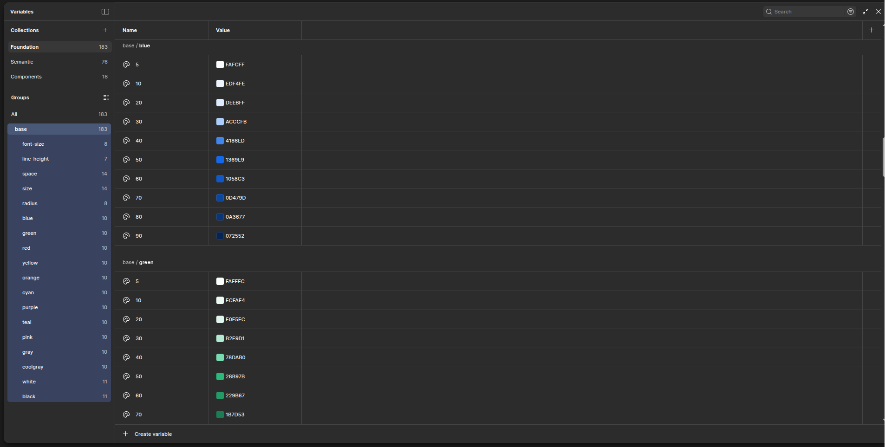
*Example of Foundation tokens showing color values organized by type (base, blue-gray, gray, green, etc.)*

---

### 🎨 Layer 2: Semantic (The Intent)

These define **how** to use the primitives. These are what designers should use.

- **Sets**: `Semantic`
- **Naming Convention**: `Semantic/{Property}/{Role}`
- **Examples**:
  - `Semantic/bg/primary` -> `{Foundation.Blue.500}`
  - `Semantic/text/danger` -> `{Foundation.Red.600}`
  - `Semantic/radius/card` -> `{Foundation.Radius.md}`

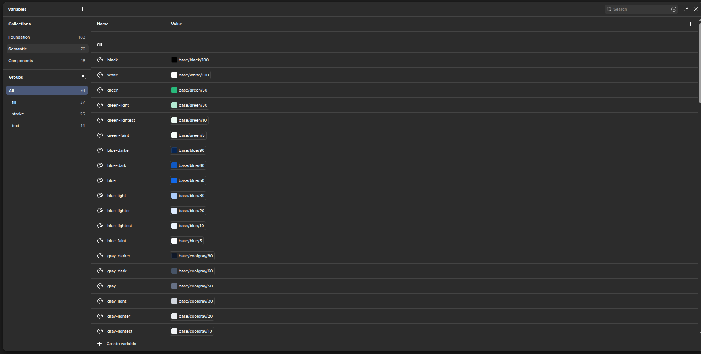
*Example of Semantic tokens showing semantic color roles like background/button, background/card, semantic/stroke/warning, etc.*

---

### 🧩 Layer 3: Components (The Specifics)

Overrides for specific components.

- **Sets**: `Components`
- **Naming Convention**: `Components/{Component}/{Property}`
- **Examples**:
  - `Components/Button/bg` -> `{Semantic.bg.primary}`

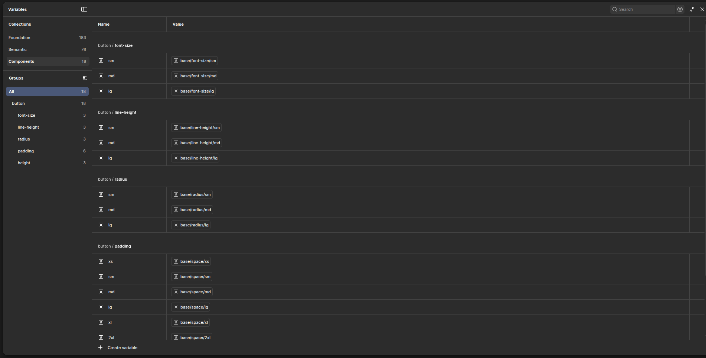
*Example of Component tokens showing specific overrides like accordion, semantic/stroke/default, scrollbar, etc.*

---

## 2. Setting Up Tokens Studio (Figma)

### Step 2.1: Open the Tokens Studio Plugin

1. In Figma, go to the **Plugins** menu
2. Search for "**Tokens Studio for Figma**"
3. Click on the plugin to open it

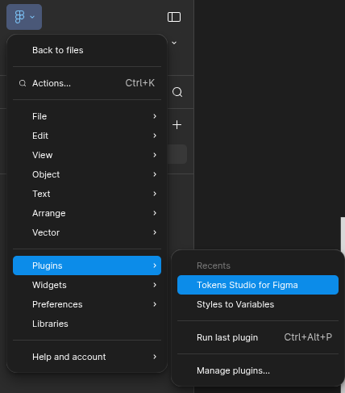
*Navigate to Plugins in the Figma menu*

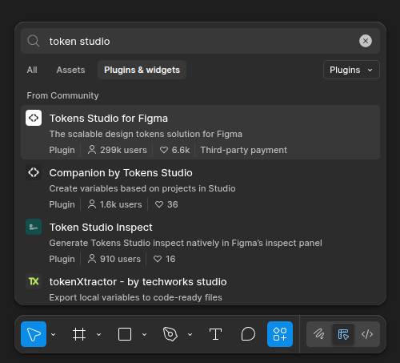
*Search for "Tokens Studio for Figma" in the plugins list*

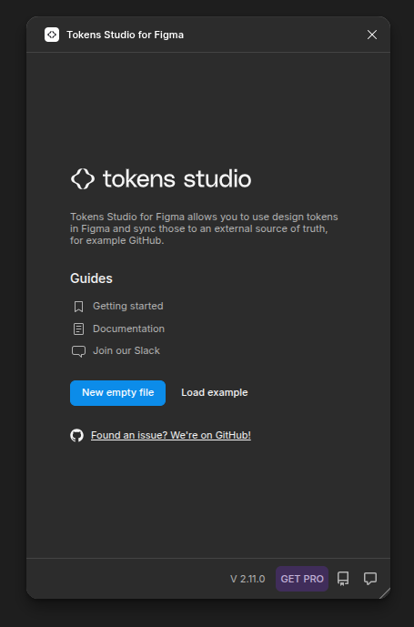
*The Tokens Studio for Figma welcome screen with options to create a new file or load an example*

---

### Step 2.2: Configure Settings

1. Click on the **Settings** tab in Tokens Studio
2. Set up your sync provider (covered in detail in Section 3)
3. Configure the following settings:
   - **Token Format**: Select **W3C DTCG format** for best compatibility
   - **Language**: Choose your preferred language (English)
   - **Base font size**: Set to `16` (standard) so `rem` conversions work correctly

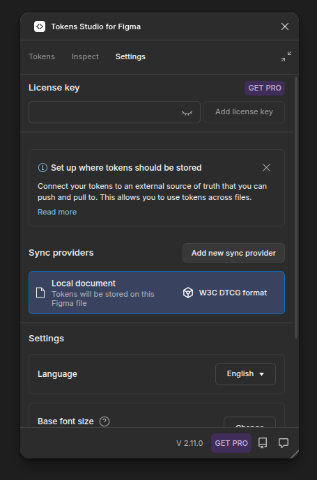
*Settings tab showing sync providers and configuration options*

---

## 3. Syncing with GitHub

Automate the handoff so developers always have the latest tokens. This is a crucial step for maintaining synchronization between design and development.

### Step 3.1: Choose Sync Provider

1. In Tokens Studio, click the **Settings** tab
2. Under **Sync providers**, click **Add new sync provider**
3. Select **GitHub** from the list of available providers


*The Settings panel showing "Add new sync provider" option*

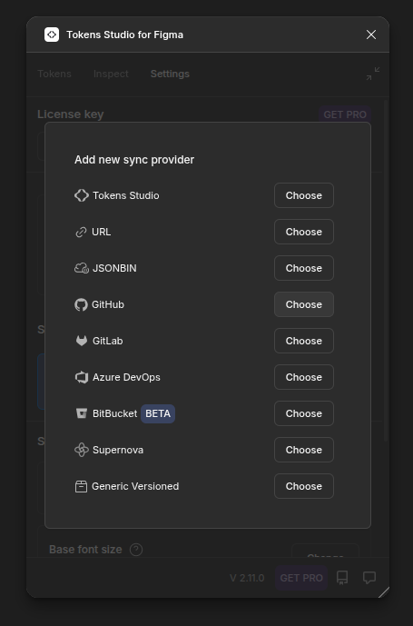
*List of available sync providers including GitHub, URL, JSONBIN, GitLab, Azure DevOps, BitBucket, Supernova, and Generic Versioned*

---

### Step 3.2: Configure GitHub Sync

Fill in the GitHub sync configuration form with your repository details:

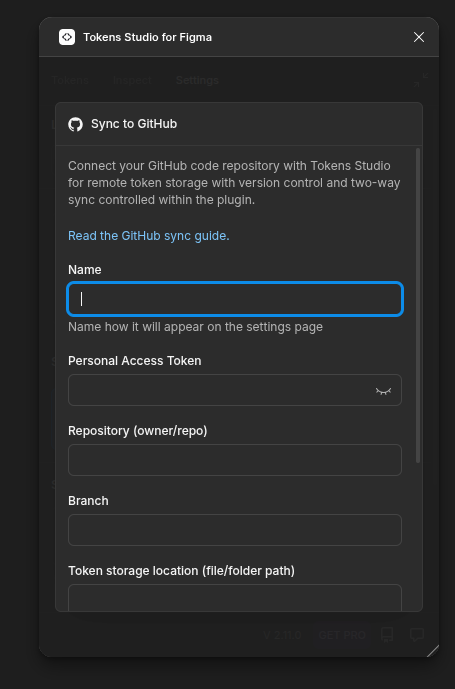
*GitHub sync configuration form showing fields for Name, Personal Access Token, Repository, Branch, and Token storage location*

**Required Fields:**

1. **Name**: Give your sync a descriptive name (e.g., "Design System Repo")
   - This is how it will appear on the settings page

2. **Personal Access Token**: Create a GitHub Classic Token
   - Go to GitHub → Settings → Developer settings → Personal access tokens → Tokens (classic)
   - Click "Generate new token (classic)"
   - Give it a name like "Tokens Studio Access"
   - Select the `repo` scope (full control of private repositories)
   - Copy the generated token and paste it here

3. **Repository (owner/repo)**: Enter your repository path
   - Format: `your-org/your-repo` 
   - Example: `nibin-org/tokvista`

4. **Branch**: Specify which branch to sync to
   - Use `main` for your production branch
   - Or create a dedicated `design` or `tokens` branch for safer testing

5. **Token storage location (file/folder path)**: Where to store the tokens
   - Common options: `tokens.json`, `src/tokens.json`, or `design/tokens.json`
   - Make sure this path exists or will be created in your repository

---

### Step 3.3: Working with Tokens

Once configured, you can start creating and organizing your tokens:

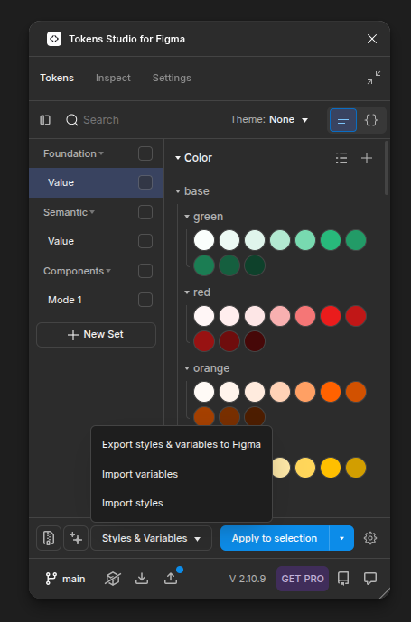
*Tokens Studio interface showing Foundation, Semantic, and Components sets with color tokens displayed*

**Creating Token Sets:**

1. Click **+ New Set** to create Foundation, Semantic, or Components sets
2. Organize your tokens following the 3-layer method described in Section 1
3. Use color pickers and value inputs to define your design tokens

---

### Step 3.4: Import/Export Variables

You can import tokens from Figma variables or export them:


*Bottom toolbar showing options for "Export styles & variables to Figma", "Import variables", and "Import styles"*

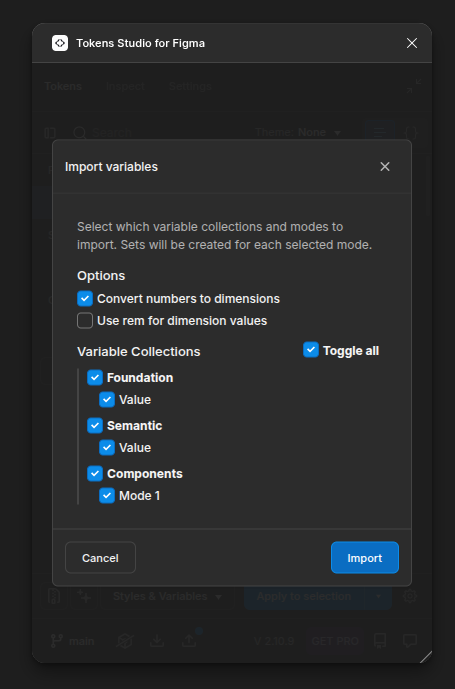
*Import variables dialog showing options to select variable collections and modes (Foundation, Semantic, Components with their respective values)*

**Import Options:**
- **Convert numbers to dimensions**: Automatically converts numeric values to dimension tokens
- **Use rem for dimension values**: Uses rem units instead of pixels
- Select which **Variable Collections** to import (Foundation, Semantic, Components)

---

### Step 3.5: Push to GitHub

After creating or updating your tokens, push them to GitHub:

1. Click the **Push to GitHub** button in the bottom toolbar


*Tokens Studio showing the "Push to GitHub" button in the bottom toolbar*

2. Enter a commit message and select the branch

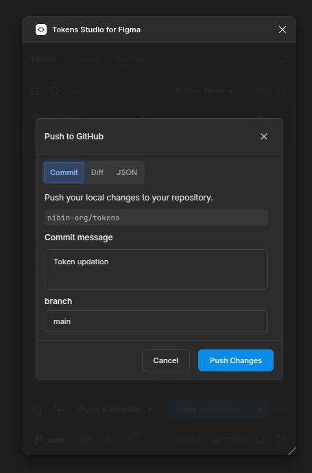
*Push to GitHub dialog showing commit message field ("Token update"), branch selection (main), and the "Push Changes" button*

3. Click **Push Changes** and wait for the sync to complete

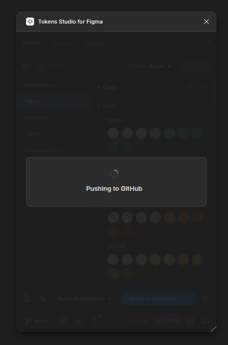
*Loading screen showing "Pushing to GitHub" in progress*

4. Confirm successful push

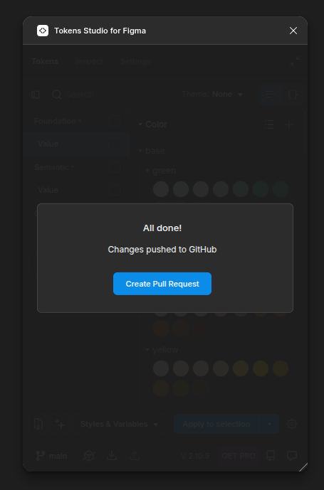
*Success dialog showing "All done! Changes pushed to GitHub" with option to "Create Pull Request"*

---

### Step 3.6: Verify in GitHub

Check your GitHub repository to confirm the tokens were pushed successfully:

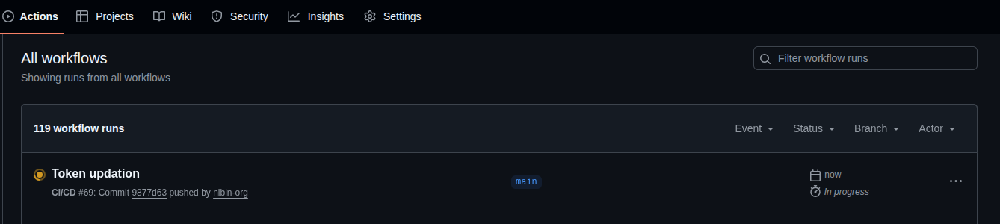
*GitHub Actions page showing "Token updation" workflow in progress*

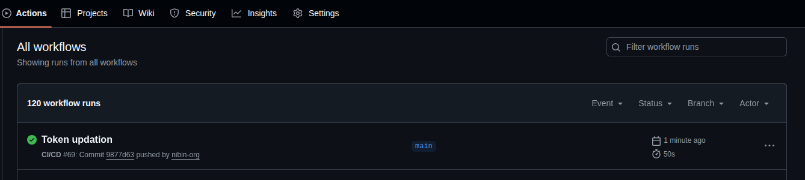
*GitHub Actions page showing successful completion of the "Token updation" workflow*

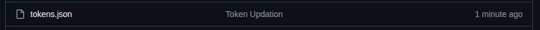
*GitHub repository showing the updated tokens.json file with timestamp "1 minute ago"*

You should see:
- Your `tokens.json` file updated in the specified path
- A commit with your message
- GitHub Actions workflow triggered (if configured)

---

## 4. Using in Your Project

Once `tokens.json` is in your repo, usage is simple:

```tsx
// src/app/page.tsx
import { TokenDocumentation } from 'tokvista';
import 'tokvista/styles.css';

// Import the JSON file synced from Figma
import tokens from '../tokens.json'; 

export default function DesignSystem() {
  return <TokenDocumentation tokens={tokens} />;
}
```

**What happens next:**

1. Your `tokens.json` file is now in your repository
2. Import it into your React/Next.js application
3. Pass it to the `TokenDocumentation` component
4. The component will automatically visualize your Foundation, Semantic, and Component tokens

---

## 5. Automation (Optional)

You can set up a **GitHub Action** to automatically publish a new NPM version whenever `tokens.json` is updated by the design team.

### Setting up GitHub Actions

Create a `.github/workflows/publish-tokens.yml` file in your repository:

```yaml
name: Publish Tokens

on:
  push:
    branches:
      - main
    paths:
      - 'tokens.json'

jobs:
  publish:
    runs-on: ubuntu-latest
    steps:
      - uses: actions/checkout@v3
      - uses: actions/setup-node@v3
        with:
          node-version: '20'
          registry-url: 'https://registry.npmjs.org'
      - run: npm ci
      - run: npm run build
      - run: npm publish
        env:
          NODE_AUTH_TOKEN: ${{ secrets.NPM_TOKEN }}
```

> **Note:** In this repository, publishing is gated by commit messages that include `release:`. If you reuse the workflow here, make sure your release process follows that rule (or adjust it to your needs).

This workflow will:
- Trigger whenever `tokens.json` is pushed to the `main` branch
- Build your package
- Automatically publish to NPM

**Benefits:**
- Designers can update tokens without developer intervention
- Automatic versioning and publishing
- Seamless design-to-code handoff

---

## 🎉 You're All Set!

Your Figma design tokens are now:
- ✅ Organized with the 3-layer method
- ✅ Synced to GitHub automatically
- ✅ Ready to use in your application
- ✅ Documented with visual components

**Next Steps:**
- Share this guide with your design team
- Create your first set of tokens following the 3-layer structure
- Test the sync by pushing changes to GitHub
- Integrate the `TokenDocumentation` component in your app
